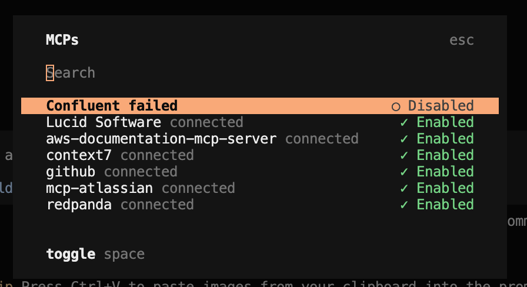

# Tools for local AI agents

## Dir structure

```
/mcp # MCP server configs for various agents
/docs # Documentation for the project
  /features # Feature planning doc created by humans, refined and used by agents
  /research # Docs showing the output of collaborative research between human and agent 
  /resources # Resources supplied to and by the agent locally
  /templates # Templates to be instantiated by agents/humans for various things
  /guides # skills for agents/humans
  /agents # AGENTS.md-like files
/scripts # Scripts for the project
```

## Specific Setup Requirements

### MCP Servers



#### Confluent

Can be used to interact with confluent clusters

Must generate auth key via:

```
npx @confluentinc/mcp-confluent --generate-key
```

then poulate it in the respective env file in `/mcp/confluent_env/`

then populate the `CONFLUENT_ENV_PATH` env var in .env

then run `script/propagate_mcp_config.py` to propagate the config to the MCP server

#### Intellij github MCP

Can be used to interact with github, including PRs, issues, etc...

Follow this confluence guide (Title: Intellij MCP Setup, Space: "Leo Scarano"): https://drivewealth.atlassian.net/wiki/spaces/~712020c5ab58d828254cf7920b8efed46bd147/pages/4416471185/Intellij+MCP+Setup?search_id=64a6fe6c-be0a-4f0d-a378-1f609a62727c

Populate appropriate credentials in `mcp/copilot_intellij_mcp.jsonc` and place file in `~/.config/github-copilot/intellij/mcp.json`

#### Opencode

Open-source version of claude code / copilot CLI / gemini. Has some benefits over the others, such as being able to switch model providers.

Follow this guide (Name: Setting up OpenCode, Space: "Leo Scarano"): https://drivewealth.atlassian.net/wiki/spaces/~712020c5ab58d828254cf7920b8efed46bd147/pages/4416143547/Setting+up+OpenCode

Simply populate vars in `/mcp/opencode.jsonc` and place file in `~/.config/opencode/opencode.jsonc`

#### Context7

Useful MCP server for looking up either the latest or the correct version documentation relevant for your project, helps reduce hallucinations

Must generate a free api key here: https://context7.com/sign-in?redirect_url=%2Fdashboard and populate it in the corresponding env file in `/mcp/`

#### Atlassian MCP

Used to interact with any Atlassian product, most notably Confluence, Jira and OpsGenie.

Simply populate the api key env var in the corresponding env file in `/mcp/` config

#### Antigravity IDE

Google's cursor competitor. Forked from vscode. Useful if you like gemini but want an IDE experience. Works seamlessly with Gemini (theoretically) and Gemini web chat. 

Populate `mcp/antigravity_mcp_config.json` with your env vars and place the file in `~/Library/Application Support/Google/Antigravity/mcp_config.json`

Schema file for mcp config is located here (on MacOS): `Applications/Antigravity.app/Contents/Resources/app/extensions/antigravity/schemas/mcp_config.schema.json`