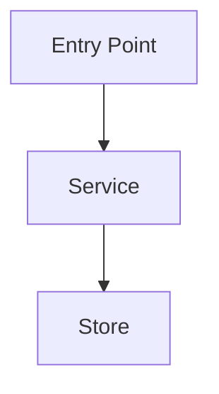
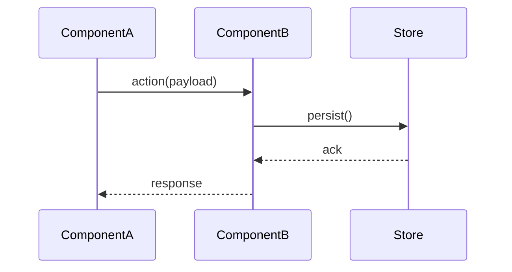

# Design: [Name]

> **Optional sections:** API Contract, Data Model, Risks & Tradeoffs, and References may be removed if not applicable to the design.

## Problem
What is broken, missing, or needs to change. One to three sentences.

---

## Goals
- What this design achieves

## Non-Goals
- What this design explicitly does not address

---

## Background
Brief context needed to understand the design. Link to relevant code, docs, or prior art.

---

## Design

### Architecture Overview
> Use a **Lucid diagram** for system-level or multi-service flows. Use **mermaid** for simpler single-service or component-level flows.

**Lucid:** [Diagram Title](https://lucid.app/lucidchart/DIAGRAM_ID/edit)

_or_



---

### API Contract
> _Optional — remove if no API changes._

```
METHOD /path
Request:  { field: type }
Response: { field: type }
Errors:   4xx/5xx cases
```

---

### Data Model
> _Optional — remove if no schema changes._

Schema changes, new entities, or field additions.

---

### Component Design
Classes, services, or modules involved and how they interact.



---

### Key Decisions
Decisions made and why. Note rejected alternatives briefly.

| Decision | Rationale |
|----------|-----------|
| Chose X over Y | Reason |

---

## Test Plan
- Unit: what is unit tested
- Integration: what requires containers or external deps
- Excluded: what is not tested and why

---

## Open Questions
- [ ] Question or research item blocking finalization

---

## Risks & Tradeoffs
> _Optional — remove if none._

- Known risks, edge cases, or tech debt introduced

---

## References
> _Optional — remove if none._

- Code: `path/to/file`
- Doc: `path/to/doc`
- External: <url>
